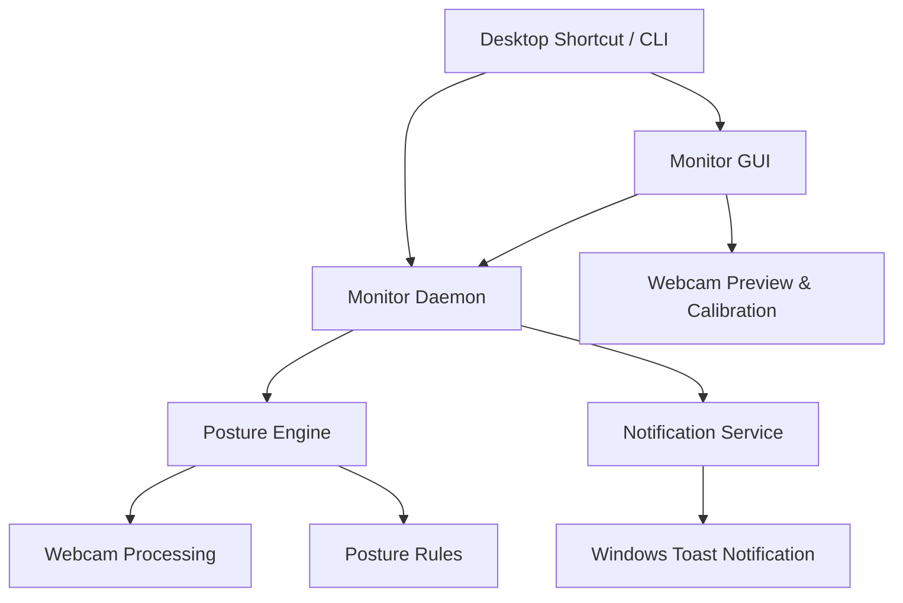

# Architecture

Monitor is designed as a local-first desktop agent for a single user. The user interacts with it through a CLI or a sleek graphical user interface (GUI), while the monitoring loop runs in the background and surfaces notifications when posture problems persist or periodic wellness timers fire.

## High-Level Flow



## Components

### Startup Launcher & Shortcuts

Purpose: Register Monitor to start when Windows logs in and manage desktop shortcuts.

Responsibilities:
- Register auto-start registry keys pointing to `pythonw.exe -m themonitor start`.
- Create native Windows desktop shortcut (`Monitor GUI.lnk`) using PowerShell.

### Monitor GUI

Purpose: Present a proper, minimal UI for configuration, calibration, and control.

Responsibilities:
- **Dashboard**: Start/stop the background daemon, launch live webcam preview, and show real-time calibration/skeleton feedback.
- **Wellness Habits**: Enable/disable water, stretch, eye-break, and stand-up reminders and adjust their intervals.
- **Configurations**: Fine-tune posture angles, alert timeouts, cooldown periods, and notify parameters. Writes settings directly to `config.yaml`.

### Monitor Daemon

Purpose: Own the background monitoring lifecycle.

Responsibilities:
- Load configuration on wake.
- Start the periodic posture checking loop.
- Manage process PIDs and shutdown signals.
- Check wellness habits timers and trigger reminders.

### Posture Engine

Purpose: Convert webcam frames into a posture assessment.

Responsibilities:
- Capture frames at a low frequency (default 4 seconds).
- Extract landmarks with MediaPipe.
- Score posture as good, fair, or bad.
- Track how long bad posture has persisted.
- Measure eye angle and head position to catch forward-leaning strain.

### Notification Service

Purpose: Notify the user only when sustained bad posture is detected.

Responsibilities:
- Display Windows desktop notifications.
- Prevent repeated alerts from becoming noisy using a cooldown.
- Keep message content short and actionable.

### Habit System

Purpose: Provide periodic wellness reminders running in the daemon.

Responsibilities:
- Define a base habit interface.
- Implement reminders for:
  - Water (hydration)
  - Stretching (stiffness prevention)
  - Eye Breaks (20-20-20 rule)
  - Standing Up (avoiding prolonged sitting)

## Design Choices

- **Local processing only** to avoid privacy risk. Webcam frames are never stored or uploaded.
- **Low sampling frequency** (4 seconds) in daemon mode to keep CPU usage minimal.
- **Separate GUI process** so that checking or configuring posture doesn't require a terminal window to remain open, and live high-frame-rate rendering only runs when the user is actively calibrating.
- **PowerShell-based shortcut generation** to ensure zero extra dependencies.

## Package Layout

```text
themonitor/ (package folder)
├── cli.py               # CLI entrypoint
├── ui.py                # Tkinter GUI application
├── daemon.py            # Background daemon
├── config.py            # Dataclasses and YAML IO
├── posture/
│   ├── detector.py      # Frame analysis coordinator
│   ├── mediapipe_engine.py  # MediaPipe integration
│   └── rules.py         # Posture geometry scoring
├── notifications/
│   └── notifier.py      # Winotify toast wrapper
└── habits/
    ├── base.py          # Abstract base
    ├── water.py         # Water hydration timer
    ├── stretch.py       # Stiff neck stretching timer
    ├── eye_break.py     # Eye strain timer
    └── stand_up.py      # Sitting time timer
```

